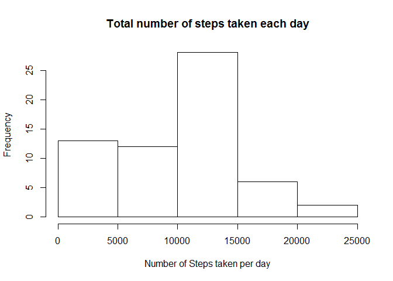
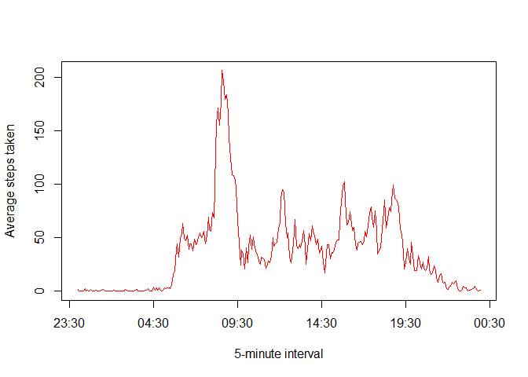
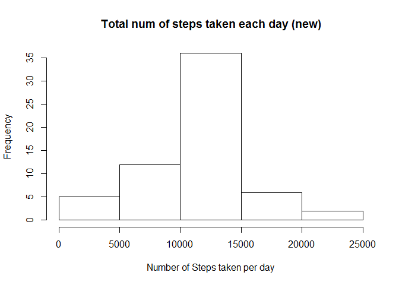
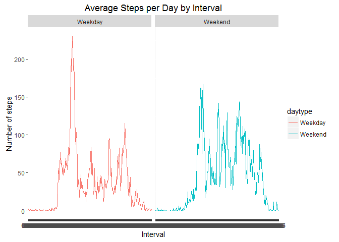

# Assignment - Reproducible Research
Uma  
February 2016  


```r
library(ggplot2)
```

```
## Warning: package 'ggplot2' was built under R version 3.2.3
```

```r
library(lattice)
library(knitr)
```

```
## Warning: package 'knitr' was built under R version 3.2.3
```

```r
library(lubridate)
```

```
## Warning: package 'lubridate' was built under R version 3.2.2
```

####Set desired Working Directory

####Dataset (csv file) downloaded from: "https://d396qusza40orc.cloudfront.net/repdata%2Fdata%2Factivity.zip"
* download.file("https://d396qusza40orc.cloudfront.net/repdata%2Fdata%2Factivity.zip", "data.zip")
* unzip("data.zip")
* "activity.csv" file extracted


#Loading and preprocessing the data

###1. Load the data (i.e. read.csv())


```r
data0 <- read.csv("activity.csv", na.strings = "NA", stringsAsFactors = FALSE)
```

###2. Process/transform the data (if necessary) into a format suitable for your analysis


```r
data1 <- data0
data1$date <- as.Date(data1$date)
data1$interval <- as.integer(data1$interval)
intervaltime <- data1$interval
intervaltime <- sprintf("%04d", intervaltime)
data1$interval <- intervaltime
intervaltime <- paste(substr(intervaltime, 1, 2), ":", substr(intervaltime, 3, 4), sep = "")
data1$intervaltime <- intervaltime
fulltime <- strptime(intervaltime, format="%H:%M")
data1$fulltime <- strptime(paste(data0$date, hour(fulltime), minute(fulltime)), format = "%Y-%m-%d %H%M")
```


#What is mean total number of steps taken per day?
For this part of the assignment, you can ignore the missing values in the dataset.

###1. Calculate the total number of steps taken per day


```r
stepsperday <- tapply(data1$steps, data1$date, sum, na.rm = TRUE)
```

###2. If you do not understand the difference between a histogram and a barplot, research the difference between them. Make a histogram of the total number of steps taken each day


```r
hist(stepsperday, main = "Total number of steps taken each day", xlab = "Number of Steps taken per day")
```

<!-- -->

###3. Calculate and report the mean and median of the total number of steps taken per day


```r
stepsperdaymean <- mean(stepsperday)
stepsperdaymedian <- median(stepsperday)
```

####Mean of the total number of steps taken per day:

```
## [1] 9354.23
```

####Median of the total number of steps taken per day:

```
## [1] 10395
```


#What is the average daily activity pattern?


```r
aggstepsbyinterval <- aggregate(steps ~ interval, data = data1, mean, na.rm = TRUE)
```

###1. Make a time series plot (i.e. type = "l") of the 5-minute interval (x-axis) and the average number of steps taken, averaged across all days (y-axis)


```r
plot(strptime(aggstepsbyinterval$interval, format = "%H%M"), aggstepsbyinterval$steps, xlab= "5-minute interval", ylab= "Average steps taken", type='l', col='red')
```

<!-- -->

###2. Which 5-minute interval, on average across all the days in the dataset, contains the maximum number of steps?


```r
intervalmaxsteps <- aggstepsbyinterval$interval[which.max(aggstepsbyinterval$steps)]
```

####5-minute interval containing the maximum number of steps: 

```
## [1] "0835"
```


#Imputing missing values
Note that there are a number of days/intervals where there are missing values (coded as NA). The presence of missing days may introduce bias into some calculations or summaries of the data.

###1. Calculate and report the total number of missing values in the dataset (i.e. the total number of rows with NAs)


```r
sumincompleterows <- sum(!complete.cases(data1$steps))
```


##Total number of missing values in the dataset (i.e. the total number of rows with NAs): 

```
## [1] 2304
```


###2. Devise a strategy for filling in all of the missing values in the dataset. The strategy does not need to be sophisticated. For example, you could use the mean/median for that day, or the mean for that 5-minute interval, etc.

####Strategy: Substitute the missing values in the dataset with the mean for that 5-minute interval 


###3. Create a new dataset that is equal to the original dataset but with the missing data filled in.


```r
data2 <- data1
for(i in 1:nrow(data2)) {
    if(is.na(data2$steps[i]) == TRUE) {
        data2$steps[i] <- aggstepsbyinterval$steps[match(data2$interval[i], aggstepsbyinterval$interval)]
    }
}
```


###4. Make a histogram of the total number of steps taken each day and Calculate and report the mean and median total number of steps taken per day. Do these values differ from the estimates from the first part of the assignment? What is the impact of imputing missing data on the estimates of the total daily number of steps?


```r
stepsperday2 <- tapply(data2$steps, data2$date, sum, na.rm = TRUE)
```


```r
hist(stepsperday2, main = "Total num of steps taken each day (new)", xlab = "Number of Steps taken per day")
```

<!-- -->


```r
stepsperdaymean2 <- mean(stepsperday2)
stepsperdaymedian2 <- median(stepsperday2)
```

####After imputing missing data, there is an increase in the total number of steps, and the impact on the estimates is detailed as follows:


####Mean of the total number of steps taken per day using new data: 

```
## [1] 10766.19
```
####Difference: 

```
## [1] 1411.959
```


####Median of the total number of steps taken per day using new data: 

```
## [1] 10766.19
```
####Difference: 

```
## [1] 371.1887
```


####Total number of steps using new data: 

```
## [1] 656737.5
```
####Difference: 

```
## [1] 86129.51
```


#Are there differences in activity patterns between weekdays and weekends?
####For this part the weekdays() function may be of some help here. Use the dataset with the filled-in missing values for this part.

###1. Create a new factor variable in the dataset with two levels - "weekday" and "weekend" indicating whether a given date is a weekday or weekend day.


```r
data3 <- data2
Weekend <- c("Saturday", "Sunday")
data3$daytype <- as.factor(ifelse(is.element(weekdays(as.Date(data3$date)), Weekend), 'Weekend', 'Weekday'))
```

###2. Make a panel plot containing a time series plot (i.e. type = "l") of the 5-minute interval (x-axis) and the average number of steps taken, averaged across all weekday days or weekend days (y-axis). 

It can be seen that there is a peak in activity earlier in the day during weekdays, and that activity is more evenly distributed over the weekend.


```r
aggstepsbyintdaytype <- aggregate(steps ~ interval + daytype, data = data3, mean)


myplot <- ggplot(aggstepsbyintdaytype, aes(factor(interval), y = steps, group = daytype, color = daytype)) + 
geom_line() + 
facet_grid(. ~ daytype, scales = "free", space="free") +
labs(x = "Interval", y = "Number of steps", title = "Average Steps per Day by Interval")

print(myplot)
```

<!-- -->


